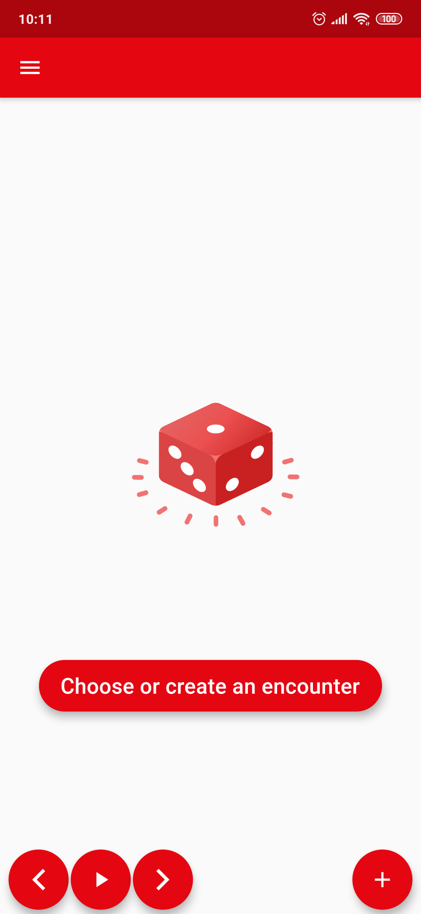
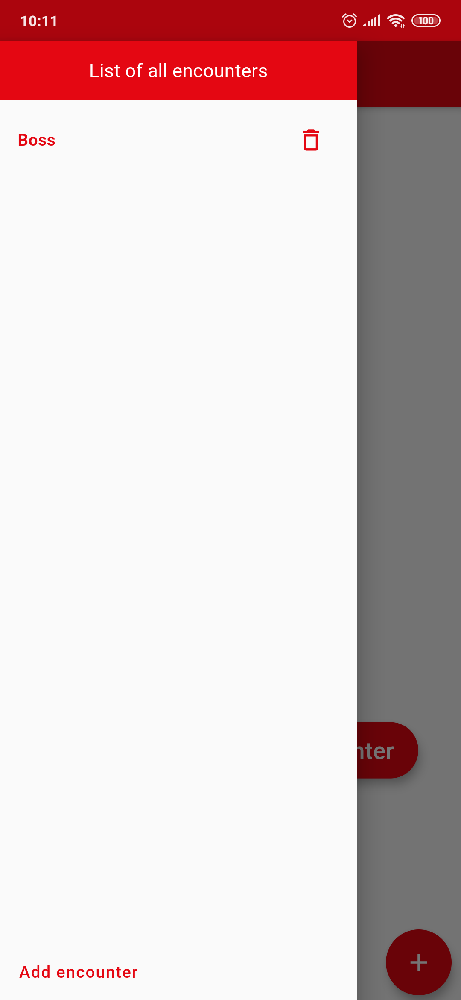
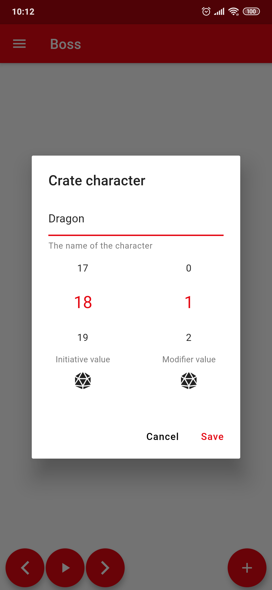
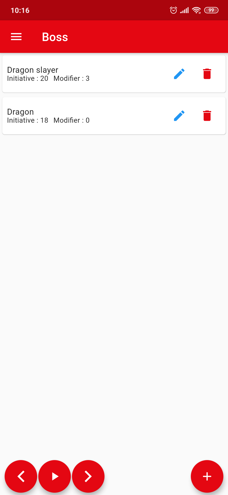
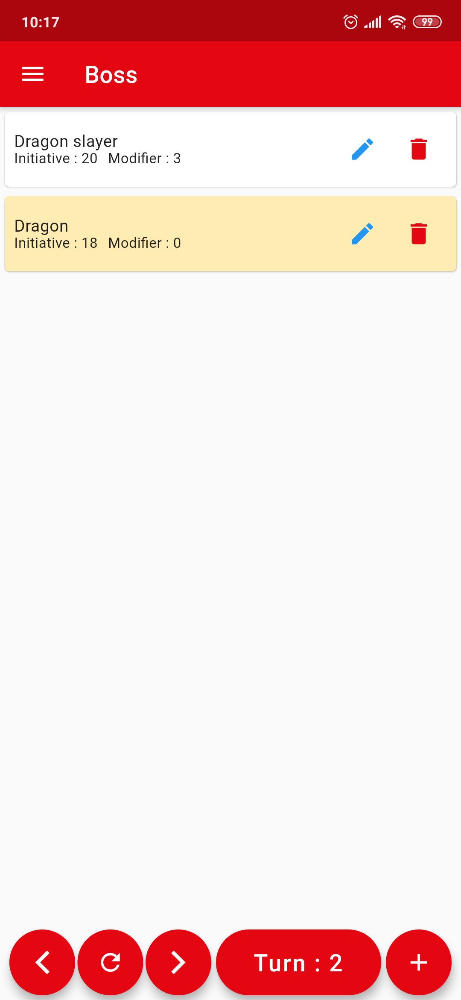

# Initiative Helper
[](https://codemagic.io/apps/5eee992cc0adbfd4cd3ffcdf/5eee992cc0adbfd4cd3ffcde/latest_build)

A simple project to help RPG DMs to easily take care of the combat initiatives. It can be used on the smartphone or on the web via [Codemagic Static Page]

## Screenshots
 
 


## Build The App
In order to build the app, it is required some generated code. You can do it following the commands below:
```
flutter packages get
flutter packages pub run build_runner build --delete-conflicting-outputs
flutter run
```
Or if you have [slidy] installed, use one of the scripts presented on the pubspec file, like:
```
slidy run build
flutter run
```
[slidy]: <https://pub.dev/packages/slidy>
[Codemagic Static Page]: <https://initiative-helper.codemagic.app/#/>
